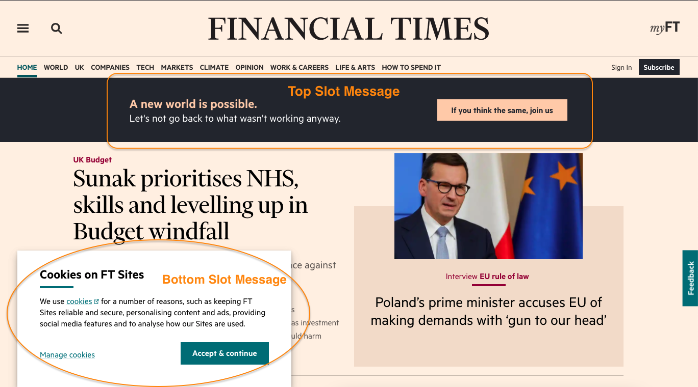
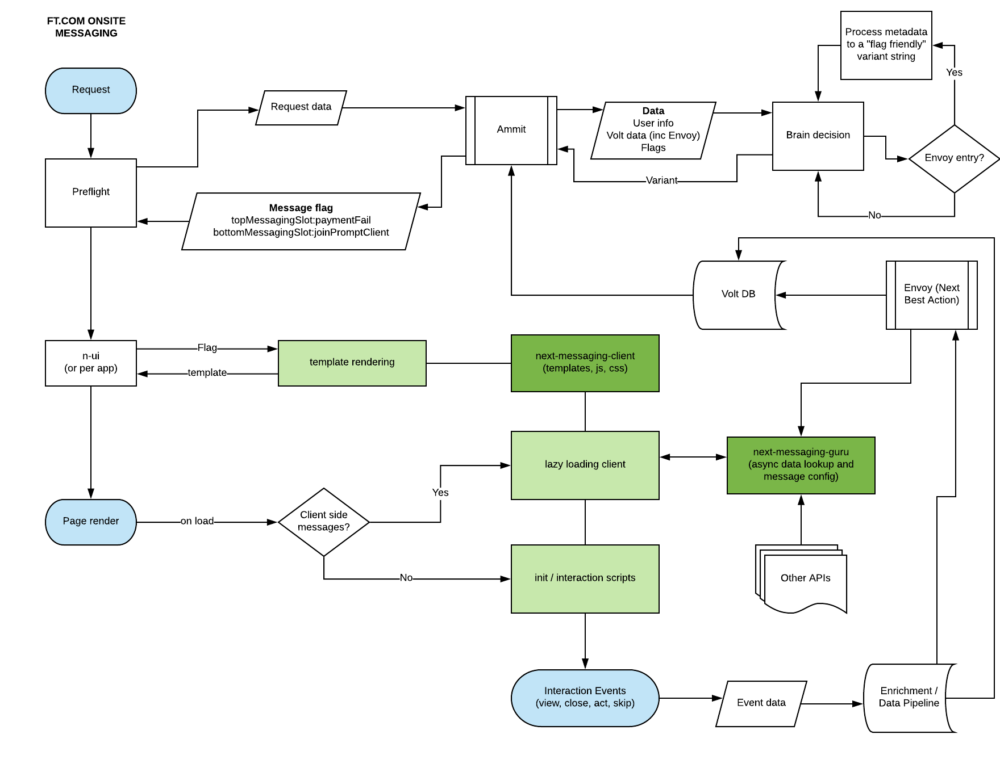

# How system messages work

This document intends to describe how the messaging system works and what kind of messages can be used. For implementation details please refer to [corporate-cancellation-message.md](./corporate-cancellation-message.md) and [#configuring-messages](../README.md#configuring-messages).

### Table of Contents

* [Introduction](#introduction)
* [Lazy vs Static messages](#lazy-vs-static-messages)
	- [Static messages](#static-messages)
	- [Lazy messages](#lazy-messages)
* [Holistic Messaging Flow](#holistic-messaging-flow)

## Introduction

There are two types of messages which can be identified in the following picture: TOP and BOTTOM messages.



## Lazy vs Static messages

When working with banner (TOP) or slider (BOTTOM) messages, two scenarios come up on loading the message content.

### Static messages
Static messages do not contain any variables and the message will always show the same, for example a banner that contains some fixed text and a CTA link button to navigate to a promotion page.

Static messages only required changes on `n-messaging-client` with the exact data they should show. There are two templates to extend and use in order to complete the task.

* TOP
	- Template: `server/templates/components/o-message`
	- Example: `server/templates/partials/top/digital-marketing-new-world.html`

	```
	{{> n-messaging-client/server/templates/components/o-message
		theme='digital-marketing-new-world'
		contentTitle='A new world is possible.'
		contentDetail='Let\'s not go back to what wasn\'t working anyway.'
		buttonUrl='https://subs.ft.com/33_digital?segmentId=16b14c00-c43e-f3fb-a3fd-2355127d3e69'
		buttonLabel='If you think the same, join us'
		closeButton=false
	}}
	```

* BOTTOM
	- Template: `server/templates/components/o-banner`
	- Example: `server/templates/partials/bottom/activation-not-complete.html`

	```
	<div class="n-messaging-client-messaging-banner n-messaging-client-messaging-banner--activation-not-complete">
		{{#> n-messaging-client/server/templates/components/o-banner
			renderOpen=true
			small=true
			themeProduct=true
		}}
			<div class="o-banner__inner" data-o-banner-inner>
				<div class="o-banner__content">
					<header class="o-banner__heading">
					<h1>Discover the stories you will love</h1>
					</header>
					<p>Select the content that most interests you, from curated newsletters to podcasts and more.</p>
				</div>
				<div class="o-banner__actions">
					<div class="o-banner__action">
					<a href="https://www.ft.com/activate/bundles" class="o-banner__button">Explore now</a>
					</div>
				</div>
			</div>
		{{/n-messaging-client/server/templates/components/o-banner}}
	</div>
	```

Note: if the message requires custom styles, it can be applied by creating a file like `client/components/bottom/<the-message>/main.scss`

### Lazy messages
This is the case when messages need an external data source to provide what is required to be shown to the user, for example different prices or subscription data by country.

When a message is marked as a `lazy`, the code make an additional async call to [next-messaging-guru](https://github.com/Financial-Times/next-messaging-guru) API to get back the message content in the client side.

For example:
* `n-messaging-client` => `manifest.js`
	```
	tryFullAccess: {
			path: 'top/lazy',
			lazy: true,
			guruQueryString: 'offerId=41218b9e-c8ae-c934-43ad-71b13fcb4465',
		},
	```
* `next-messaging-guru`: https://github.com/Financial-Times/next-messaging-guru/blob/main/server/components/try-full-access/main.js

When using lazy messages, the template is automatically filled with the data coming from `next-messaging-guru` and there is no need to create an html file.

### Holistic Messaging Flow

